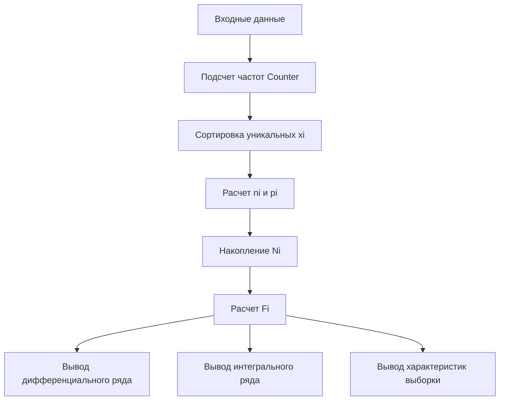

# Лабораторная 1 (часть 2): простое объяснение

## Что делает программа
Файл `lab1_part2.py` берет выборку чисел и строит:

1. Дифференциальный ряд (`xi, ni, pi`)
2. Интегральный ряд (`xi, Ni, Fi`)
3. Основные числовые характеристики (среднее, дисперсия, мода, медиана и т.д.)

---

## Обозначения (самое важное)
- `n` - объем выборки (сколько всего чисел)
- `xi` - уникальные значения выборки в порядке возрастания
- `ni` - сколько раз встретилось значение `xi` (частота)
- `pi` - относительная частота значения `xi`
- `Ni` - накопленная частота (сумма частот от начала до текущего значения)
- `Fi` - накопленная относительная частота

---

## Формулы
### 1) Дифференциальный ряд
\[
p_i = \frac{n_i}{n}
\]

То есть для каждого `xi` считаем:
- сколько раз оно встретилось (`ni`)
- делим на общее число наблюдений `n` и получаем `pi`

### 2) Интегральный ряд
\[
N_i = \sum_{j=1}^{i} n_j
\]
\[
F_i = \frac{N_i}{n} = \sum_{j=1}^{i} p_j
\]

Смысл:
- `Ni` накапливает частоты слева направо
- `Fi` показывает долю наблюдений, не превышающих текущее значение

---

## Как это считается в коде
1. `Counter(data)` считает частоты значений.
2. `sorted(freq.keys())` дает отсортированные `xi`.
3. Цикл формирует `ni`.
4. В цикле считается `pi = ni / n`.
5. `accumulate(ni)` строит накопленные частоты `Ni`.
6. В цикле считается `Fi = Ni / n`.
7. Все складывается в строки таблицы: `[xi, ni, pi, Ni, Fi]`.

---

## Наглядный пример на вашей выборке
Выборка:
`[17, 18, 16, 16, 17, 18, 19, 17, 15, 17, 19, 18, 16, 16, 18, 18, 12, 17, 15, 15]`

`n = 20`

| xi | ni | pi    | Ni | Fi    |
|----|----|-------|----|-------|
| 12 | 1  | 0.05  | 1  | 0.05  |
| 15 | 3  | 0.15  | 4  | 0.20  |
| 16 | 4  | 0.20  | 8  | 0.40  |
| 17 | 5  | 0.25  | 13 | 0.65  |
| 18 | 5  | 0.25  | 18 | 0.90  |
| 19 | 2  | 0.10  | 20 | 1.00  |

Проверка:
- сумма `ni = 20 = n`
- сумма `pi = 1.00`
- последнее `Ni = n`, последнее `Fi = 1`

---

## Мини-картинка (идея интегрального ряда)
`Ni` растет ступеньками:

```text
xi: 12   15   16   17   18   19
Ni:  1 -> 4 -> 8 ->13 ->18 ->20
Fi: .05 .20  .40  .65  .90 1.00
```

То есть каждая следующая точка добавляет частоту текущего значения.

---

## Схема работы программы


---

## Как объяснить преподавателю в 20 секунд
Программа сначала строит дифференциальный ряд: уникальные значения `xi`, их частоты `ni` и относительные частоты `pi = ni/n`.  
Потом из него строит интегральный ряд: накопленные частоты `Ni = n1 + ... + ni` и накопленные доли `Fi = Ni/n`.  
После этого выводит основные статистики выборки (среднее, моду, медиану, дисперсии, СКО, коэффициент вариации).
