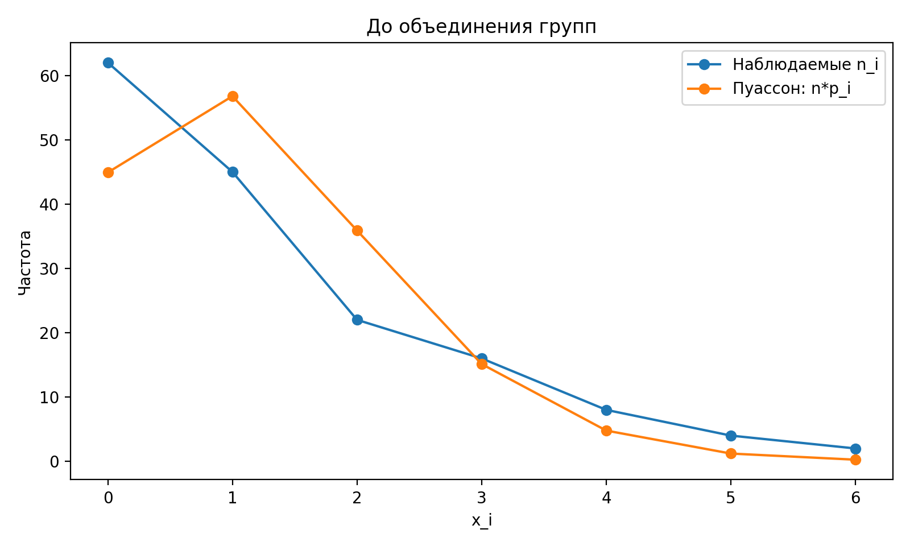
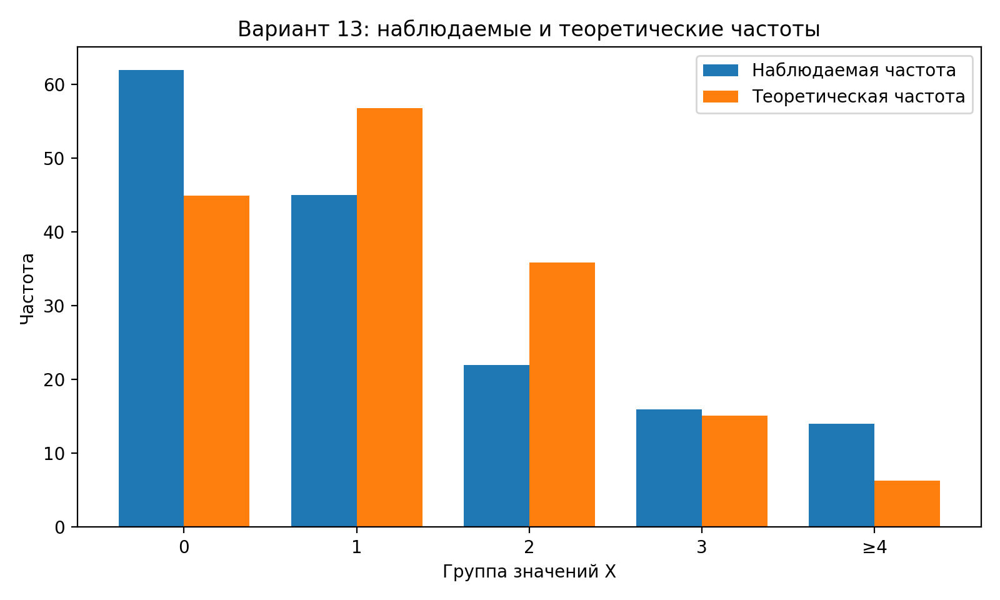

# Лабораторная работа №2. Вариант 13

## Тема

Проверка гипотезы о том, что случайная величина распределена по закону Пуассона.

Вариант 13:

> Случайная величина `X` — число нестандартных изделий в одной партии.

Данные из задания:

| `x_i` | 0 | 1 | 2 | 3 | 4 | 5 | 6 |
|---:|---:|---:|---:|---:|---:|---:|---:|
| `n_i` | 62 | 45 | 22 | 16 | 8 | 4 | 2 |

В листе указано `n = 200`, но сумма частот равна:

```text
62 + 45 + 22 + 16 + 8 + 4 + 2 = 159
```

Поэтому в расчетах я беру фактический объем выборки:

```text
n = 159
```

Иначе таблица частот будет противоречить сама себе.

---

## Что здесь вообще происходит

У нас есть наблюдения: сколько раз в партии встретилось `0`, `1`, `2`, ... нестандартных изделий.

Нужно проверить, похоже ли это на распределение Пуассона.

Распределение Пуассона часто используют для подсчета количества редких событий:

- число ошибок;
- число отказов;
- число брака;
- число сбоев;
- число заявок за промежуток времени.

Здесь событие — появление нестандартного изделия в партии.

---

## Гипотезы

Основная гипотеза:

```text
H0: случайная величина X имеет распределение Пуассона.
```

Альтернативная гипотеза:

```text
H1: случайная величина X не имеет распределение Пуассона.
```

Уровень значимости:

```text
α = 0.05
```

Это значит: мы допускаем 5% риск ошибочно отвергнуть правильную гипотезу.

---

## Закон Пуассона

Если случайная величина `X` имеет распределение Пуассона, то вероятность получить значение `m` считается так:

```text
P(X = m) = (λ^m / m!) * e^(-λ)
```

Где:

- `m` — конкретное значение случайной величины;
- `λ` — параметр распределения Пуассона;
- `e` — математическая константа, примерно `2.718`;
- `m!` — факториал числа `m`.

---

## Оценка параметра λ

Параметр `λ` для распределения Пуассона равен среднему числу событий.

Так как настоящее `λ` неизвестно, мы оцениваем его по выборке:

```text
λ = Σ(x_i * n_i) / n
```

Подставляем данные:

```text
λ = 1.2642
```

То есть в среднем по выборке получается примерно `1.26` нестандартного изделия на одну партию.

---

## Расчет вероятностей и теоретических частот

Сначала считаем вероятности Пуассона для каждого `x_i`.

Потом переводим вероятности в теоретические частоты:

```text
теоретическая частота = n * P(X = x_i)
```

Таблица до объединения:

|   x_i |   n_i |     p_i |   теор. частота |
|------:|------:|--------:|----------------:|
|     0 |    62 | 0.28248 |          44.914 |
|     1 |    45 | 0.3571  |          56.778 |
|     2 |    22 | 0.22571 |          35.888 |
|     3 |    16 | 0.09511 |          15.123 |
|     4 |     8 | 0.03006 |           4.779 |
|     5 |     4 | 0.0076  |           1.208 |
|     6 |     2 | 0.0016  |           0.255 |

---

## Почему нужно объединять группы

В критерии χ² нельзя нормально использовать слишком маленькие частоты.

Преподаватель отдельно сказал: если частота для какого-то `x_i` меньше 5, такие группы надо объединять.

В исходных данных маленькие частоты:

```text
x = 5, n_i = 4
x = 6, n_i = 2
```

Кроме этого, теоретическая частота для `x = 4` тоже меньше 5.

Поэтому логично объединить хвост распределения:

```text
4, 5, 6 и все более большие значения → группа ≥4
```

После объединения группы такие:

```text
0, 1, 2, 3, ≥4
```

---

## Таблица для критерия χ²

| группа   |   набл. частота n_i |   вероятность p_i |   теор. частота n*p_i |   вклад в χ² |
|:---------|--------------------:|------------------:|----------------------:|-------------:|
| 0        |                  62 |            0.2825 |               44.9142 |       6.4996 |
| 1        |                  45 |            0.3571 |               56.7783 |       2.4433 |
| 2        |                  22 |            0.2257 |               35.8882 |       5.3745 |
| 3        |                  16 |            0.0951 |               15.1227 |       0.0509 |
| ≥4       |                  14 |            0.0396 |                6.2967 |       9.4241 |

Сумма последнего столбца дает эмпирическое значение критерия:

```text
χ²_эмп = 23.7925
```

---

## Степени свободы

Формула для числа степеней свободы:

```text
df = k - 1 - s
```

Где:

- `k` — число групп после объединения;
- `1` вычитается из-за условия, что сумма вероятностей равна 1;
- `s` — число параметров, которые мы оценили по выборке.

У нас:

```text
k = 5
s = 1, потому что мы оценивали λ
df = 5 - 1 - 1 = 3
```

---

## Критическое значение

Для уровня значимости `α = 0.05` и `df = 3`:

```text
χ²_кр = 7.8147
```

Сравниваем:

```text
χ²_эмп = 23.7925
χ²_кр  = 7.8147
```

Так как:

```text
χ²_эмп > χ²_кр
```

то гипотезу `H0` нужно отвергнуть.

Также:

```text
p-value = 0.000028
```

Это намного меньше `0.05`, поэтому вывод такой же.

---

## Итоговый вывод

На уровне значимости `α = 0.05` гипотеза о том, что число нестандартных изделий в одной партии распределено по закону Пуассона, **отвергается**.

Проще говоря: данные варианта 13 плохо согласуются с распределением Пуассона.

---

## Графики

График до объединения групп:



График после объединения групп:



На графике видно, что наблюдаемые частоты заметно отличаются от теоретических частот распределения Пуассона. Особенно это заметно для `x = 0`, `x = 1`, `x = 2` и группы `≥4`.

---

## Python-код

```python
import numpy as np
import pandas as pd
import matplotlib.pyplot as plt
from scipy.stats import chi2
from math import exp, factorial

# Вариант 13.
# В листе написано n = 200, но частоты дают сумму 159:
# 62 + 45 + 22 + 16 + 8 + 4 + 2 = 159.
# Поэтому в расчетах берем n как сумму наблюдаемых частот.

x = np.array([0, 1, 2, 3, 4, 5, 6])
n_i = np.array([62, 45, 22, 16, 8, 4, 2])

alpha = 0.05
n = n_i.sum()

# Оценка параметра λ для распределения Пуассона:
# λ = среднее значение X по выборке.
lam = (x * n_i).sum() / n

print(f"Объем выборки n = {n}")
print(f"Оценка λ = {lam:.4f}")

def poisson_p(k, lam):
    """Вероятность P(X = k) для распределения Пуассона."""
    return exp(-lam) * lam**k / factorial(k)

p_i = np.array([poisson_p(k, lam) for k in x])
theor_i = n * p_i

raw_table = pd.DataFrame({
    "x_i": x,
    "n_i": n_i,
    "p_i": p_i,
    "теор_частота": theor_i
})

print("\nТаблица до объединения:")
print(raw_table.round(4))

# По замечанию преподавателя объединяем группы с маленькими частотами.
# У нас n_i = 4 и n_i = 2 слишком маленькие, а также теоретическая частота
# для x=4 меньше 5, поэтому удобно объединить хвост: x >= 4.
groups = ["0", "1", "2", "3", ">=4"]

obs = np.array([
    n_i[0],
    n_i[1],
    n_i[2],
    n_i[3],
    n_i[4:].sum()
])

p = np.array([
    poisson_p(0, lam),
    poisson_p(1, lam),
    poisson_p(2, lam),
    poisson_p(3, lam),
    1 - sum(poisson_p(k, lam) for k in range(4))
])

exp_freq = n * p
chi_parts = (obs - exp_freq) ** 2 / exp_freq
chi_emp = chi_parts.sum()

# Степени свободы:
# k - число групп после объединения,
# 1 - из-за условия суммы вероятностей,
# 1 - потому что λ оценивали по выборке.
df = len(groups) - 1 - 1

chi_crit = chi2.ppf(1 - alpha, df)
p_value = 1 - chi2.cdf(chi_emp, df)

result_table = pd.DataFrame({
    "группа": groups,
    "набл_частота": obs,
    "вероятность": p,
    "теор_частота": exp_freq,
    "вклад_в_chi2": chi_parts
})

print("\nТаблица после объединения:")
print(result_table.round(4))

print(f"\nχ² эмпирическое = {chi_emp:.4f}")
print(f"χ² критическое = {chi_crit:.4f}")
print(f"Степени свободы = {df}")
print(f"p-value = {p_value:.6f}")

if chi_emp < chi_crit:
    print("Вывод: гипотеза о распределении Пуассона не отвергается.")
else:
    print("Вывод: гипотеза о распределении Пуассона отвергается.")

# График для отчета
idx = np.arange(len(groups))
width = 0.38

plt.figure(figsize=(8, 4.8))
plt.bar(idx - width / 2, obs, width, label="Наблюдаемая частота")
plt.bar(idx + width / 2, exp_freq, width, label="Теоретическая частота")
plt.xticks(idx, groups)
plt.xlabel("Группа значений X")
plt.ylabel("Частота")
plt.title("Вариант 13: наблюдаемые и теоретические частоты")
plt.legend()
plt.tight_layout()
plt.savefig("variant13_poisson_plot.png", dpi=200)
plt.show()

```

---

## Как с этим работать

1. Сначала заносим в массивы `x` и `n_i` значения из варианта.
2. Считаем фактический объем выборки `n`.
3. Находим `λ` как среднее значение.
4. По формуле Пуассона считаем вероятности.
5. Переводим вероятности в теоретические частоты.
6. Объединяем маленькие группы.
7. Считаем критерий χ².
8. Сравниваем его с критическим значением.
9. Делаем вывод: отвергается гипотеза или нет.
